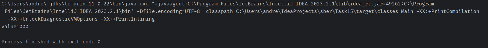
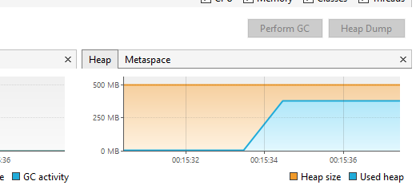
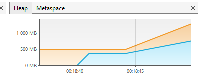

# Задание 15

### Задание 1
По JIT:
Сделать цикл на 100000 итераций, в цикле в предварительно созданную Map<Integer, String> сложить ключ - индекс, значение - "value" + индекс 
Запустить с опцией -XX:+PrintCompilation, проанализировать информацию в консоли
Запустить с опцией -XX:+PrintCompilation -XX:+UnlockDiagnosticVMOptions -XX:+PrintInlining , проанализировать информацию в консоли

Я вроверил все версии java с 11й по 21ю, ни одна из них вывода мне на дала.

### Задание 2

Запустить приложение создающее много объектов с разными GC, посмотреть в jvisualvm как заполняются объекты в разных областях памяти(heap)

результат с G1GC

Serial

